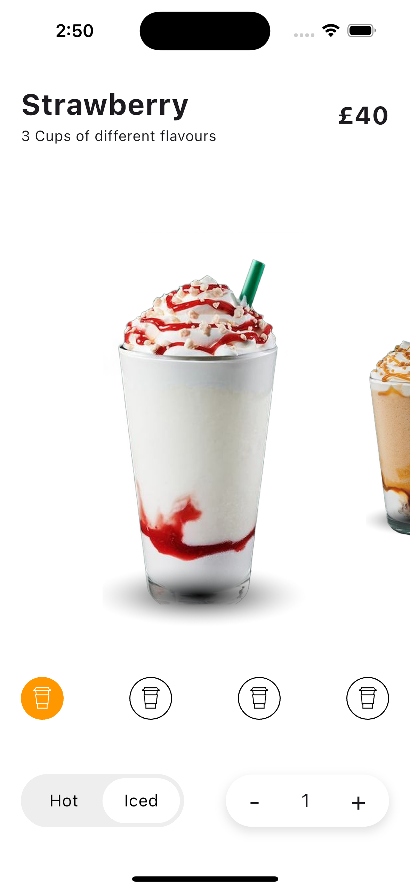

# coffee_animate

# 🍓 Drink Detail Screen - Flutter UI

A minimal and modern drink detail screen built with Flutter. This screen displays product info, image, options for cup size, temperature, and quantity adjustment.

## ✨ Features

- Product name and description
- Price display in GBP (£)
- High-quality drink image
- Cup size selector
- Temperature toggle (Hot / Iced)
- Quantity selector

## 📱 Screenshot

> Simulator: iPhone 16 – iOS

## 🛠 Technologies

- Flutter
- Dart
- Custom UI Design
- Cupertino & Material Mix

## 📁 How to Use

1. Clone the repository
2. Add image to `assets/images/drink_detail.png`
3. Run `flutter pub get`
4. Launch the app on any device

## 🔖 License

This project is open-source and free to use under the MIT license.
